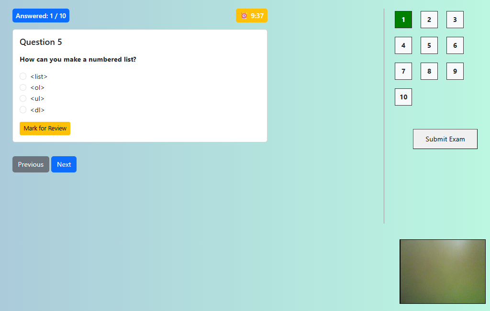
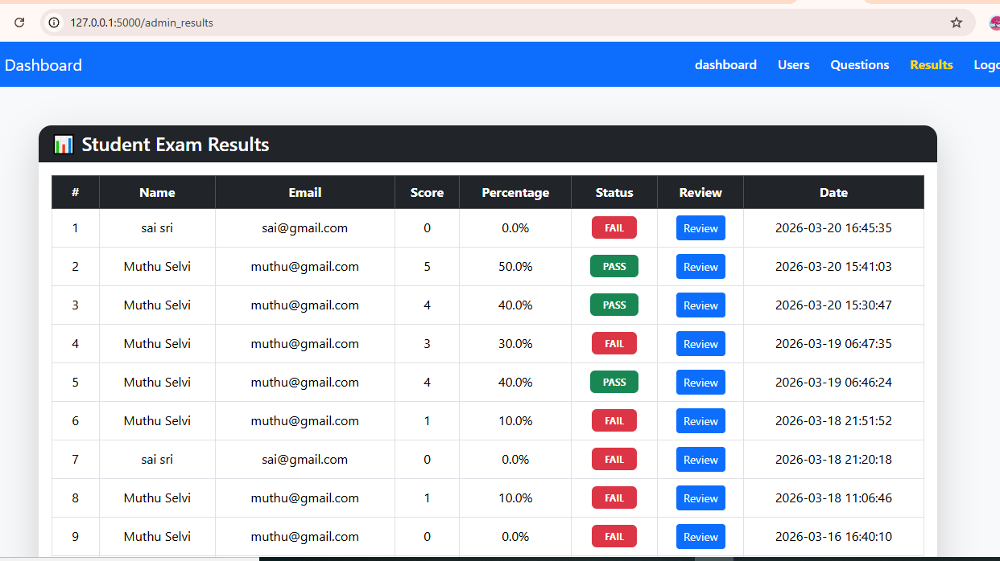
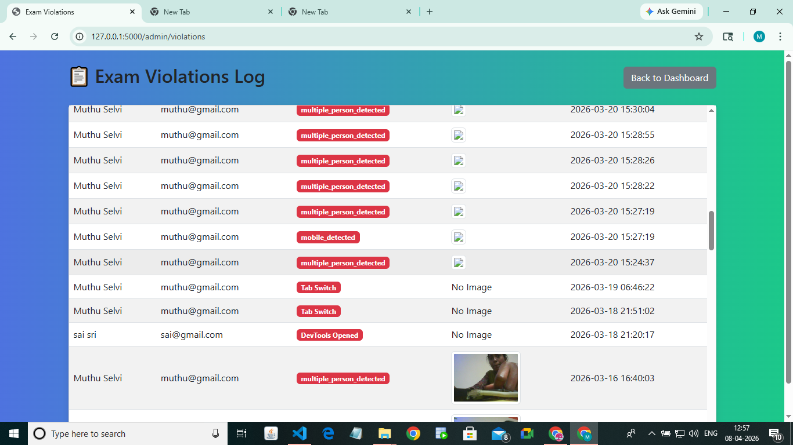

# Smart Online Exam Proctoring System

A robust, AI-powered Full Stack web application designed to maintain academic integrity during online assessments. Built to scale with real-time proctoring and secure database management.

## 🚀 Key Technical Features
* **Full Stack Architecture:** Developed using **Flask (Python)** for the backend and **Bootstrap/CSS/HTML** for a responsive, mobile-friendly interface.
* **Database Management:** Utilized **MySQL Workbench** for secure storage of student records, exam results, and proctoring logs.
* **AI-Powered Proctoring:**
    * **Real-time Malpractice Detection:** Integration of **YOLOv8** to identify unauthorized mobile devices and secondary persons.
    * **Identity Verification:** Multi-face recognition against predefined datasets.
* **Exam Security:** * Forced Fullscreen mode & tab-switch detection.
    * Copy-paste prevention to ensure a cheating-free environment.
    * Live webcam feed processing using OpenCV.

## 🛠 Tech Stack
* **Frontend:** HTML5, CSS3, Bootstrap 5
* **Backend:** Python, Flask Framework
* **Database:** MySQL Workbench
* **AI/Computer Vision:** OpenCV, YOLOv8 (Ultralytics)

## 📂 Project Structure
- `/static` - Contains CSS, JavaScript, and images.
- `/templates` - HTML files built with Bootstrap.
- `/models` - Pretrained YOLOv8 weights and face recognition logic.
- `app.py` - Main Flask application routing and controller logic.

## ⚙️ Installation & Setup
1. Clone the repository:
   `git clone https://github.com/Muthumundasamy/smart_online_exam_system.git`
2. Install dependencies:
   `pip install -r requirements.txt`
3. Configure your MySQL database using the provided schema.
4. Run the application:
   `python app.py`

## 📸 Screenshots

### 🔐 Login Page

### 📝 Exam Page

### 📊 Result Page

### 🤖 AI Detection

---
*Developed as a Full Stack Developer Intern.*
